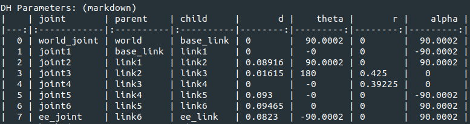

# ros2_urdf_to_dh_parameters
ROS2 Package for Converting URDF To DH Parameters. Assuming that joint frames are standardized. Otherwise, it may not give good results.

Original Repository -> https://github.com/mcevoyandy/urdf_to_dh

Installation:
```
pip3 install anytree
pip3 install pandas
pip3 install tabulate
```

Create a workspace, build and source:
```
mkdir urdf_to_dh_ws
cd urdf_to_dh_ws
mkdir src
cd src
git clone https://github.com/mehmet-engineer/ros2_urdf_to_dh_parameters
cd ..
colcon build
source install/setup.bash
```

Usage with terminal CLI:
```
ros2 run urdf_to_dh generate_dh --ros-args -p urdf_file:="<urdf_file>"
```

UR5 example:


